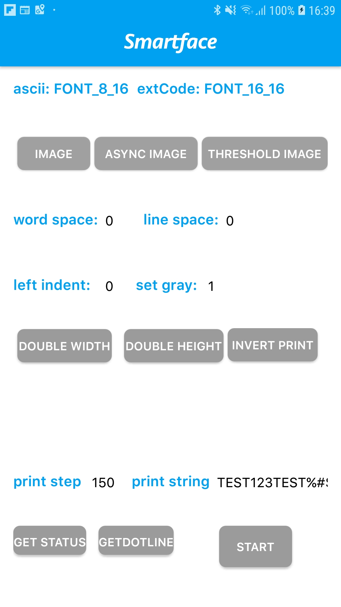

<h3 align="center">
  
</h3>

# NeptuneLiteAPI Sample from Smartface

  

Hey there, this repository sample usage of [sf-plugin-neptuneliteapi](https://github.com/smartface/sf-plugin-neptuneliteapi)

## Support & Documentation & Useful Links

- [Guides](https://developer.smartface.io)
- [API Docs](http://ref.smartface.io)
- [Smartface Cloud Dashboard](https://cloud.smartface.io)
- [Download Smartface On-Device Emulator](https://smf.to/app) (Works only from your device)